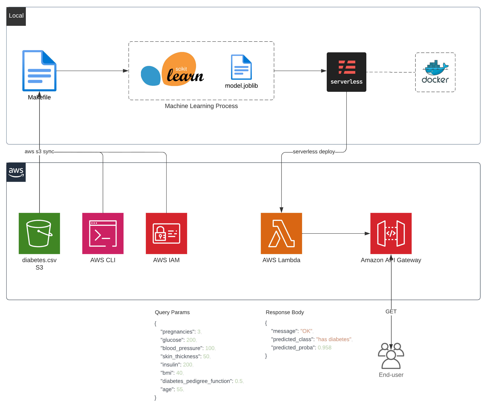

# Machine Learning Operations - Diabetes

  <em>Serverless machine learning batch prediction on AWS.</em>

 

## 📖 Project

### 👨🏻‍🏫 Introduction
The focus of this project is on the productionizing/operation of a serverless Machine Learning model on AWS.

A simple dataset was chosen for this task ([US National Institute of Diabetes, Digestive and Kidney Diseases: Pima Indian Diabetes](#-features)). The dataset presents diagnostic measurements from female patients of at least 21 years old of Pima heritage as variables and indicates if the patient has or does not have diabetes.

A quick process of ML is developed in the [notebook](notebooks/1.0-creating-the-model.ipynb) of the project. Data is ingested from AWS S3, the model - that predicts if a patient has diabetes or not based on 8 medical exam features - is created locally and deployed using serverless framework to AWS Lambda. Then, AWS API Gateway makes it available for the public.

You can get an example prediction for a 55 years-old patient, who had 3 pregnancies, with a glucose of 200,a blood-pressure of 100, an insulin of 200, triceps skin thickness of 50 an a diabetes genetic function of 0.5 in the following link:

https://q6l78vh36a.execute-api.sa-east-1.amazonaws.com/development/lambda-prediction?pregnancies=3&glucose=200&blood_pressure=100&skin_thickness=50&insulin=200&bmi=40&diabetes_pedigree_function=0.5&age=55

(You may change the parameters directly on the URL to get different predictions)

### 🎯 Goal
Deploy serverless Machine Learning predictions on AWS.

### 📊 Results
The model achieved an accuracy of 72% and an ROC-AUC of 71%.

### 📈 Features
| Feature                  | Description                                                                           |
|--------------------------|---------------------------------------------------------------------------------------|
| `pregnancies`            | Number of pregnancies the patient had.                                               |
| `glucose`                | Plasma glucose concentration 2 hours after an oral glucose tolerance test.           |
| `blood_pressure`         | Diastolic blood pressure (mm Hg).                                                    |
| `skin_thickness`         | Triceps skin fold thickness (mm).                                                    |
| `insulin`                | 2-Hour serum insulin exam (mu U/ml).                                                 |
| `bmi`                    | Body mass index (weight in kg/(height in m)^2).                                      |
| `diabetes_pedigree_function` | Genetic predisposition to diabetes (from 0 to 1).                                   |
| `age`                    | Patient age.    

## 🗺  Methodology

## 🗄 Notebooks

- [1.0-creating-the-model.ipynb](/notebooks/1.0-creating-the-model.ipynb)

## 📦 Folder Structure

    ├── LICENSE
    ├── Makefile           <- Makefile with commands like `make deploy_model`
    ├── README.md          <- The top-level README for developers using this project.
    ├── data
    │
    ├── models             <- Trained and serialized models.
    │
    ├── notebooks          <- Jupyter notebooks. Naming convention is a number (for ordering),
    │                         and a short `-` delimited description, e.g.
    │                         `1.0--creating-the-model.ipynbß`.
    │
    ├── deployment         <- All files dockerized and deployed to AWS Lambda, like "handler.py".
    │
    ├── references         <- Explanatory materials.
    │
    ├── requirements.txt   <- The requirements file for reproducing the analysis environment, e.g.
    │                         generated with `pip list --format=freeze > requirements.txt`
